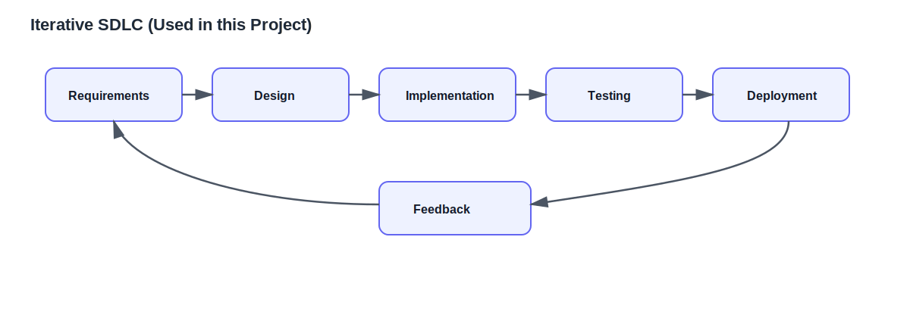
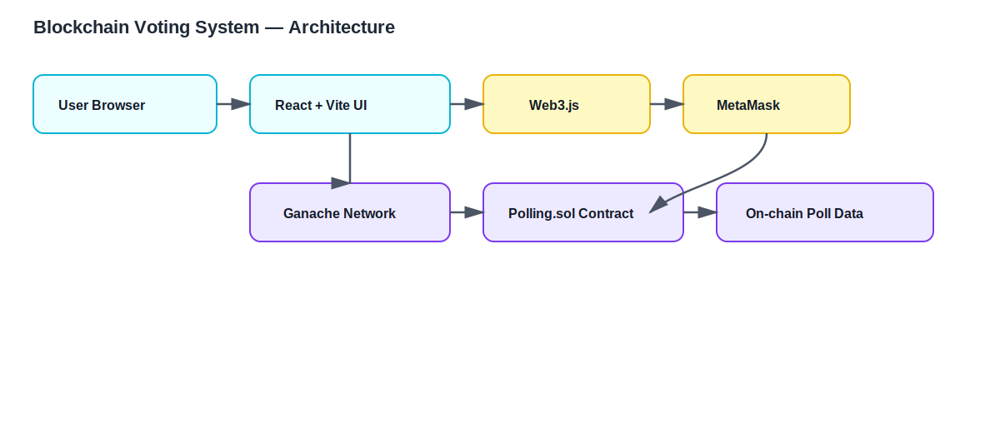
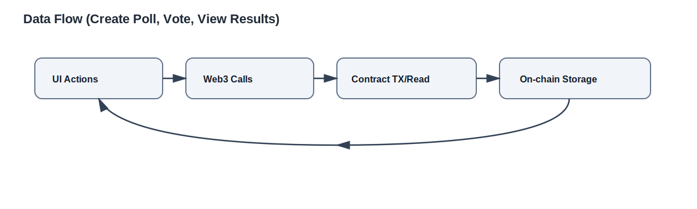
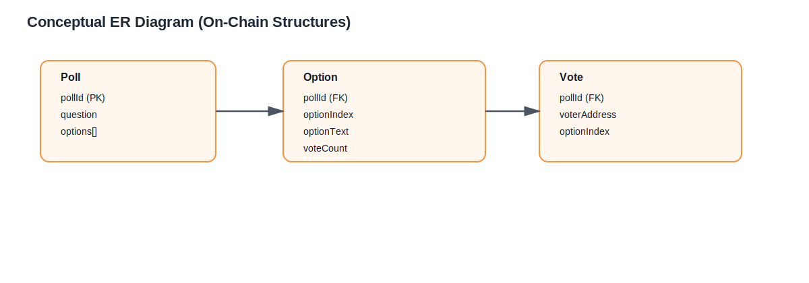
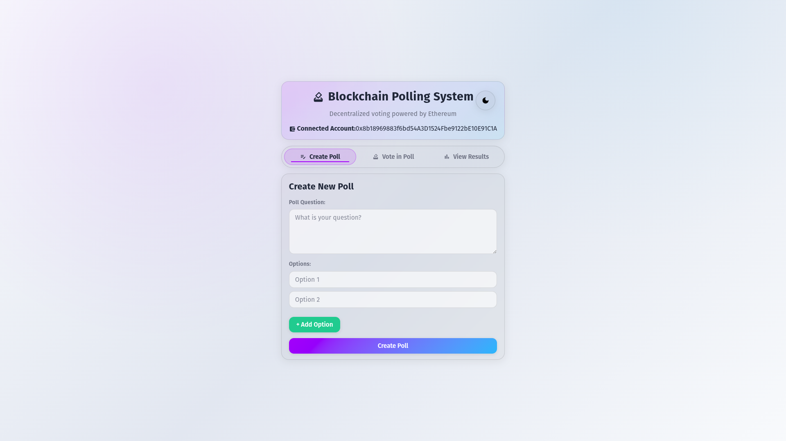
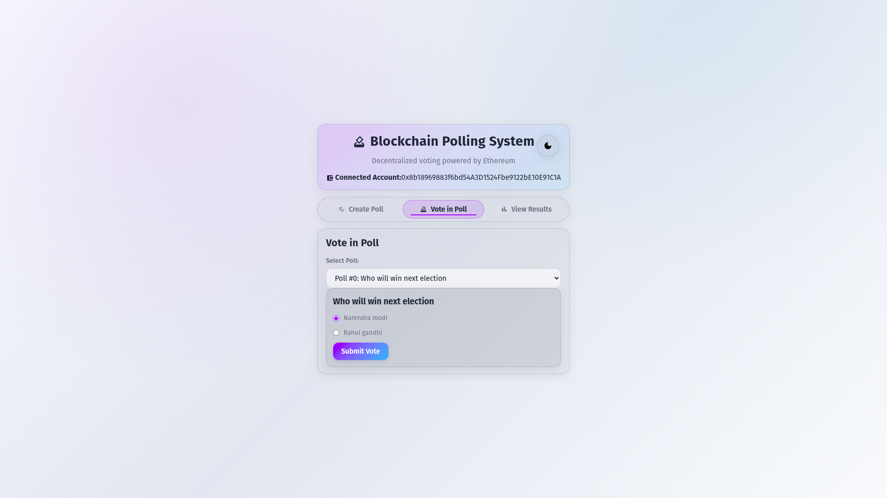
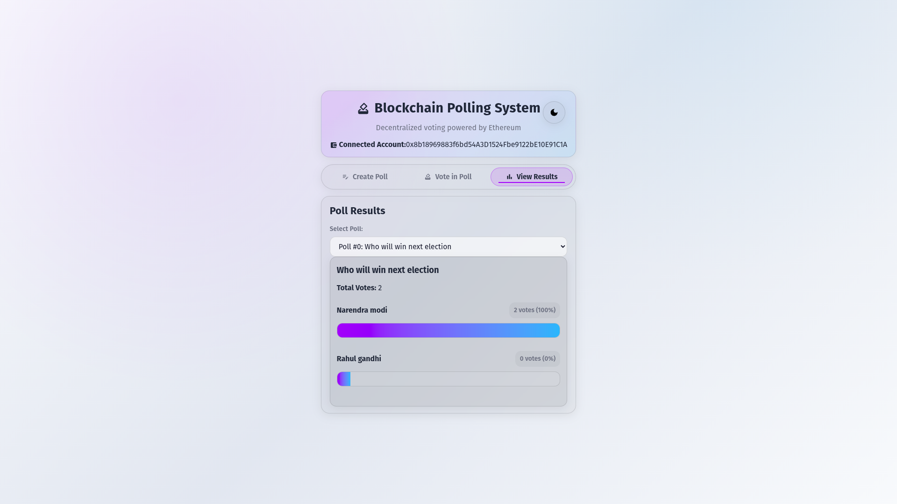

# 📘 Project Documentation Structure (FULL MARKS VERSION)

## 1️⃣ Title Page 
---

## 2️⃣ Abstract

**1 page max**

This project designs and develops a **web-based blockchain voting system** that allows users to create polls, cast votes, and view results securely using smart contracts. It targets small organizations, academic elections, and community polls that need transparent, tamper‑resistant voting. The system uses **React (Vite)** for the frontend, **Solidity** smart contracts deployed with **Truffle**, and **Web3** to connect the UI with the blockchain. The outcome is a **decentralized, auditable polling platform** that reduces manual handling, increases trust, and provides real‑time results.

---

## 3️⃣ Problem Statement

* Traditional polling relies on manual counting, which is slow and error‑prone.
* Centralized systems can be altered by administrators or attackers.
* Voters have limited visibility into how results are computed.
* Existing tools often lack transparency, auditability, and tamper resistance.

---

## 4️⃣ Objectives

* Provide secure, tamper‑resistant voting using blockchain.
* Enable poll creation and vote casting through a web UI.
* Prevent double voting using smart‑contract checks.
* Deliver real‑time results with transparent auditability.
* Improve trust and transparency for all participants.

---

## 5️⃣ Scope of the Project

**Will do:**

* Create polls with multiple options.
* Allow users to vote once per poll.
* Display results with vote counts and percentages.
* Integrate MetaMask for wallet connection.
* Store poll data on-chain for transparency.

**Will not do:**

* National‑scale elections or biometric verification.
* Voter identity verification beyond wallet ownership.
* Offline voting or paper ballot integration.
* Advanced analytics or AI prediction.

Example:

> The system does not include facial recognition or national database integration.

This shows **engineering maturity**.

---

## 6️⃣ Software Development Life Cycle (SDLC)

**SDLC model used → Iterative**

**Why:** The project integrates multiple technologies (React, Web3, Solidity). Iterative development allows incremental testing of UI, smart contract functions, and blockchain integration, reducing risk and improving stability.

---

## 7️⃣ Requirement Analysis

### 🔹 Functional Requirements

* Wallet connection via MetaMask.
* Poll creation with dynamic options.
* Vote submission with one‑vote‑per‑address rule.
* Poll listing and selection.
* Result calculation and display.

### 🔹 Non‑Functional Requirements

* Security (smart‑contract integrity, no double voting).
* Performance (fast UI response, efficient on‑chain reads).
* Scalability (support multiple polls and many voters).
* Availability (blockchain ensures data is always accessible).
* Usability (simple, responsive UI).

---

## 8️⃣ System Contract (VERY IMPORTANT 🔥)

### 🔹 User Contracts

**1) Public Voter**
* **Responsibilities:** Connect wallet, choose poll, submit vote.
* **Access rights:** Can view polls and results; can vote once per poll.
* **Restrictions:** Cannot modify poll data or vote twice.

**2) Poll Creator / Admin**
* **Responsibilities:** Create polls, manage options.
* **Access rights:** Create polls through the UI.
* **Restrictions:** Cannot edit or delete polls after creation (immutability).

**3) Auditor / Viewer**
* **Responsibilities:** Verify results and transparency.
* **Access rights:** Read‑only access to on‑chain data and results.
* **Restrictions:** Cannot create or vote.

This screams **professional software design**.

---

## 9️⃣ System Architecture

**Explain:**

* **Client (Frontend):** React + Vite app (Create Poll, Vote, View Results).
* **Server (Blockchain API):** Web3 provider + MetaMask handling.
* **Database (Blockchain):** Ethereum test network (Ganache) storing polls and votes in the smart contract.

**Project‑Specific Components:**

* **Smart Contract:** [contract/contracts/Polling.sol](contract/contracts/Polling.sol) defines polls, options, and vote rules.
* **Contract Build & Deploy:** Truffle scripts in [contract/migrations/1_deploy_contracts.js](contract/migrations/1_deploy_contracts.js).
* **Web3 Integration:** [src/utils/app.js](src/utils/app.js) connects UI to the contract and exposes poll APIs.
* **UI Components:** [src/components](src/components) (CreatePoll, VotePoll, ViewResults, Header).

**Data Flow:**
1. User connects wallet in the UI.
2. UI calls Web3 functions.
3. Web3 sends transactions to the Polling smart contract.
4. Contract stores poll/vote data on-chain.
5. UI reads results and displays updates.

---

## 🔟 Database Design

### 🔹 ER Diagram

**On‑Chain Data Structures (Smart Contract):**

| Entity | Attributes | Notes |
| ------ | ---------- | ----- |
| Poll | pollId, question, options[] | Stored as struct in contract |
| Vote | pollId, voterAddress, optionIndex | Mapped by address to prevent double voting |
| Result | pollId, optionVotes[] | Derived from stored counts |

**Primary & Foreign Keys (Conceptual):**
* `pollId` as primary key for Poll.
* `pollId` as foreign key in Vote and Result.
* `voterAddress + pollId` as composite key to restrict multiple votes.

---

## 1️⃣1️⃣ Backend Design

* **Smart Contract (Solidity):** Handles poll creation, vote submission, and result retrieval.
* **Web3 Layer:** Connects React UI to contract through MetaMask.
* **Authentication:** Wallet ownership (signature‑based connection).
* **Role‑based authorization:** Admin can create; users can vote; all can view results.
* **Data validation:** Option limits, non‑empty questions, one‑vote‑per‑address rule.

**Tech stack:** Solidity + Truffle + Ganache + Web3.

---

## 1️⃣2️⃣ Frontend Design (MARKS GOLD)

**Include:**

* UI layout explanation (Tabs: Create Poll, Vote, View Results)
* Component structure (Header, CreatePoll, VotePoll, ViewResults)
* Navigation flow (tab-based navigation)
* Accessibility considerations (clear labels, contrast, error messages)

**Mention:**

* Icons (Material Icons via MUI)
* Responsive design for desktop and mobile

---

## 1️⃣3️⃣ Testing (DON’T SKIP TABLES)

### 🔹 Testing Types

* Unit Testing (smart‑contract functions)
* Integration Testing (Web3 + UI)
* System Testing (end‑to‑end poll lifecycle)
* User Acceptance Testing (manual verification by users)

### 🔹 Test Case Table (Mandatory)

| Test Case ID | Description | Input | Expected Output | Result |
| ------------ | ----------- | ----- | --------------- | ------ |
| TC-01 | Connect wallet | MetaMask connect | Wallet address shown | Pass |
| TC-02 | Create poll | Question + options | Poll stored on-chain | Pass |
| TC-03 | Vote once | Valid poll + option | Vote recorded, count increases | Pass |
| TC-04 | Double vote | Vote twice | Second vote rejected | Pass |
| TC-05 | View results | Select poll | Correct counts/percentages | Pass |

Professors **love tables**.

---

## 1️⃣4️⃣ Security Considerations

* Wallet‑based authentication (MetaMask).
* Smart‑contract checks to prevent double voting.
* Input validation for poll question and options.
* Immutability of on‑chain data ensures tamper resistance.
* No sensitive personal data stored on-chain.

---

## 1️⃣5️⃣ Results & Screenshots

* Create Poll form

* Vote Poll screen

* Results page

---

## 1️⃣6️⃣ Limitations

* No voter identity verification beyond wallet address.
* Requires internet and blockchain connection.
* Works best for small to medium poll sizes.
* Gas fees exist for transactions on public networks.

---

## 1️⃣7️⃣ Future Enhancements

* Mobile app version.
* Advanced voter verification (DID / KYC).
* Off‑chain analytics dashboard.
* Notification system for poll updates.

---

## 1️⃣8️⃣ Conclusion

The blockchain voting system successfully delivers a transparent and tamper‑resistant polling platform. It meets the objectives of secure voting, real‑time results, and improved trust. The project demonstrates practical application of blockchain, smart contracts, and modern web development.

---

## 1️⃣9️⃣ References

* Solidity Documentation
* Truffle Suite Documentation
* Web3.js Documentation
* React + Vite Documentation
* Research papers on blockchain‑based e‑voting
