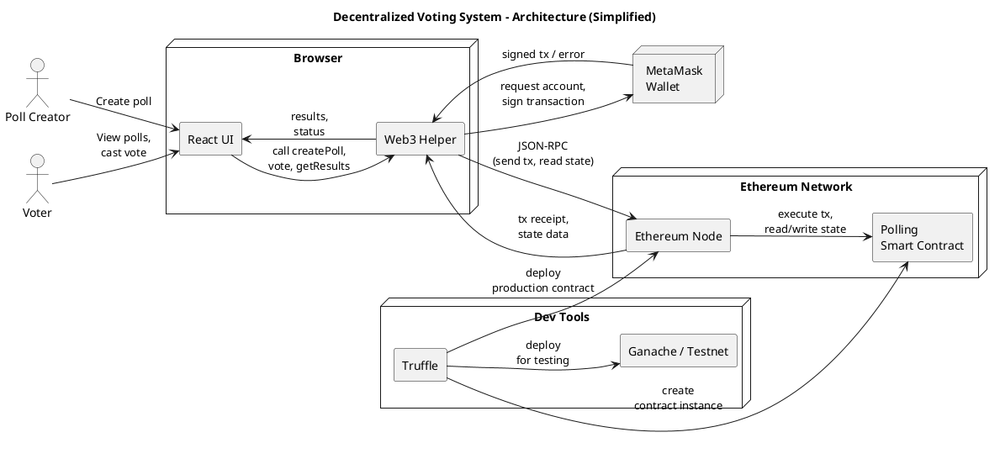

using the plantuml code to make the architecture 

```plantuml
@startuml
title Decentralized Voting System – Architecture (Simplified)

left to right direction  

skinparam componentStyle rectangle
skinparam shadowing false
skinparam fontsize 12

actor "Poll Creator" as Creator
actor "Voter" as Voter

node "Browser" as Browser {
  component "React UI" as FE
  component "Web3 Helper" as Web3Client
}

node "MetaMask\nWallet" as MetaMask

node "Ethereum Network" as Eth {
  component "Ethereum Node" as Node
  component "Polling\nSmart Contract" as Contract
}

node "Dev Tools" as Dev {
  component "Truffle" as Truffle
  component "Ganache / Testnet" as NetDev
}

' Users use the UI
Creator --> FE : Create poll
Voter --> FE : View polls,\ncast vote

' UI to Web3 + wallet
FE --> Web3Client : call createPoll,\nvote, getResults
Web3Client --> MetaMask : request account,\nsign transaction
MetaMask --> Web3Client : signed tx / error

' Web3 to blockchain
Web3Client --> Node : JSON-RPC\n(send tx, read state)
Node --> Contract : execute tx,\nread/write state
Node --> Web3Client : tx receipt,\nstate data
Web3Client --> FE : results,\nstatus

' Dev and deployment
Truffle --> NetDev : deploy\nfor testing
Truffle --> Node : deploy\nproduction contract
Truffle --> Contract : create\ncontract instance

@enduml
```
